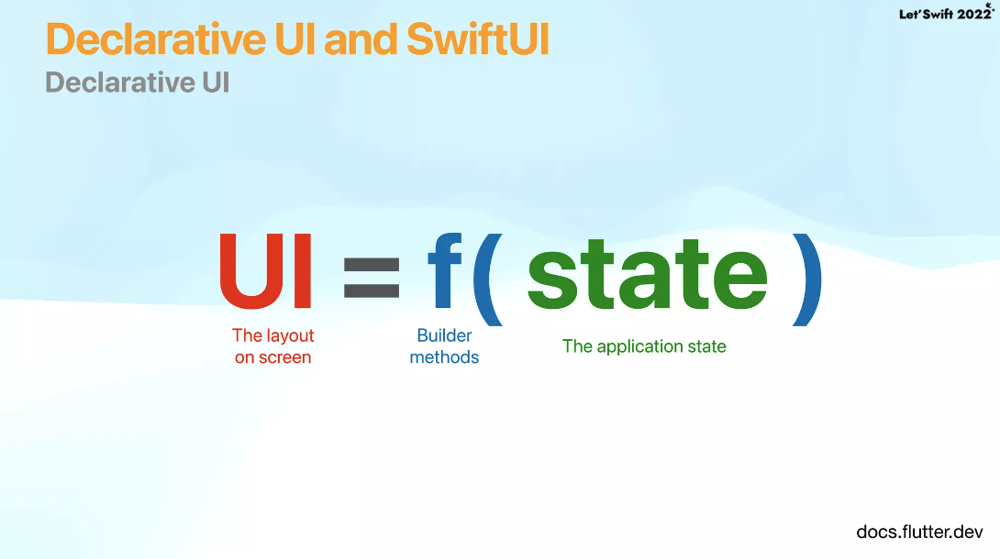
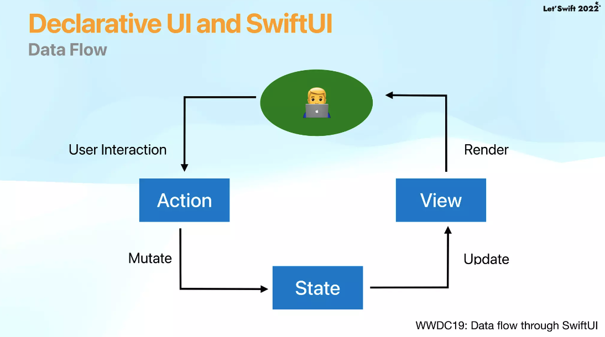
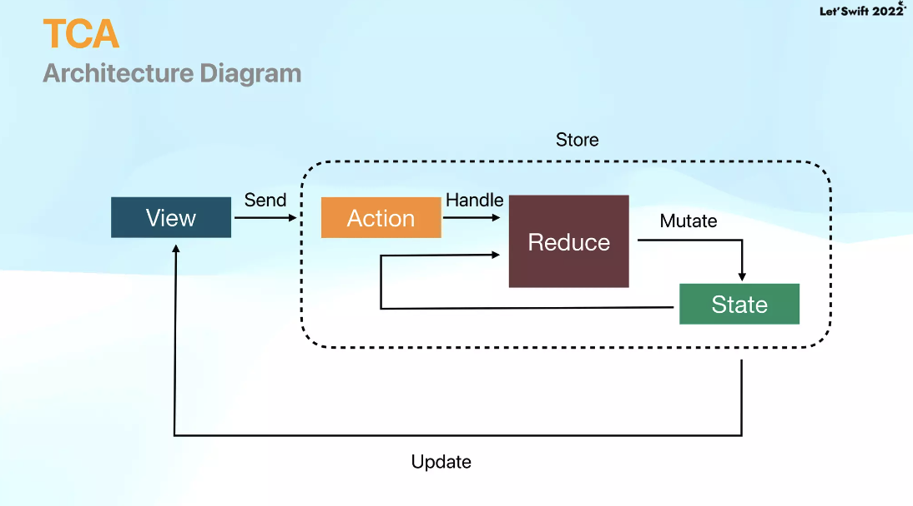

# 목차
- Demo
- Declarative UI and SwiftUI
- TCA
- Workshop1: SwiftUI에 TCA 적용
- Effect and Dependency
- Workshop2: Github API 연동
- Workshop3: 실시간 검색 구현

# Declarative UI and SwiftUI

# TCA
### What is TCA?

- The Composable Architecture introduced by PointFree
- Unidirectional data flow architecture : ex) elm, Redux, MVI, ReactorKit 단방향

### Why should I use TCA?
- Better State Management
- Easy to debug
- Enhance Testability
- Modularization(Composability)

# 참고 자료
- 레츠스위프트22 발표 자료: https://www.slideshare.net/ssuser3d03b2/swiftui-tca-github-search
