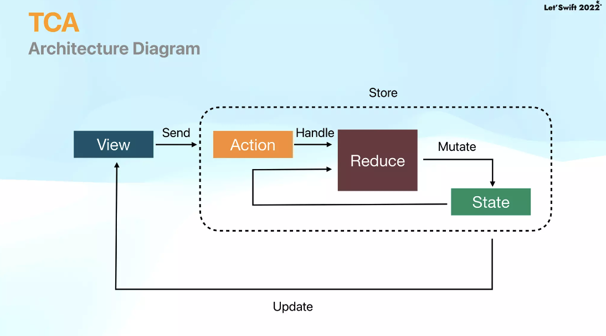
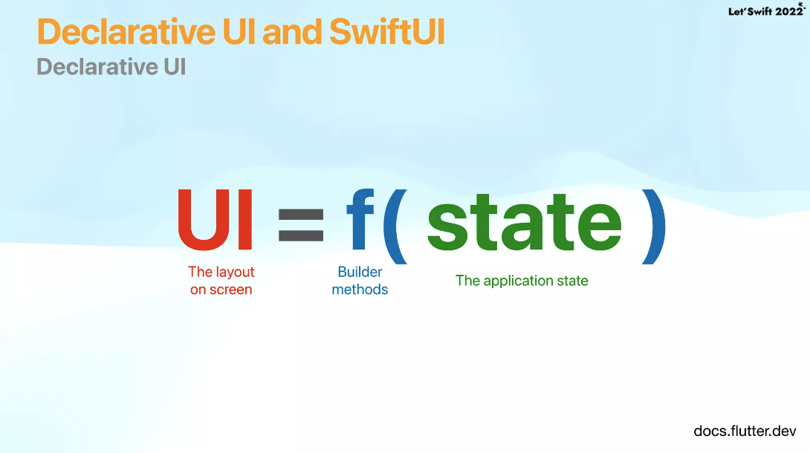
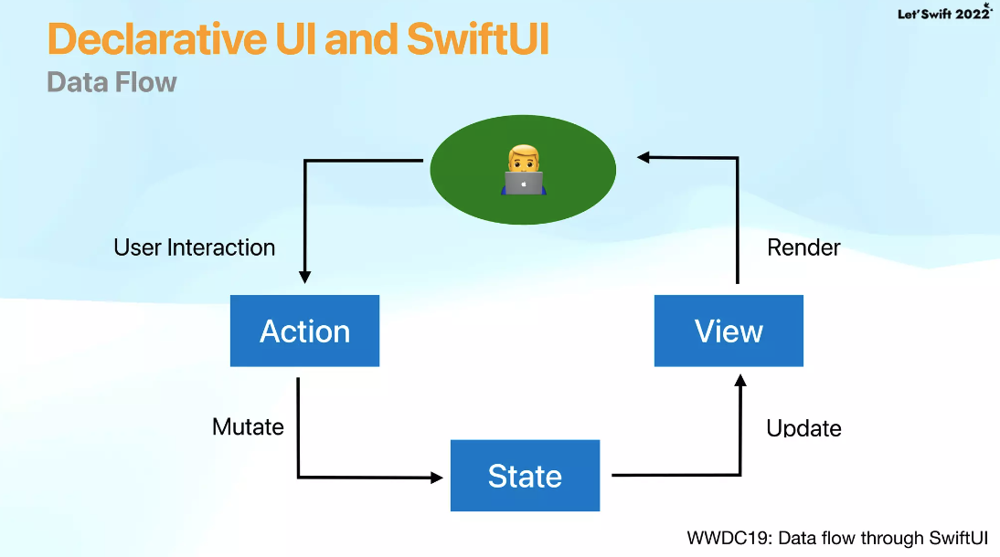

# TCA 란?

- PointFree에 의해 소개된 방식으로 **The Composable Architecture**의 약어로, Store의 State 변화에 따라 View를 업데이트 해 주는 상태 기반의 단반향 아키텍처입니다.
- 상태 관리 방식으로, 비슷한 방식에는 Redux, reswift, reactorkit, elm, MVI가 있다. 

# 기본 구성
To build a feature using the Composable Architecture you define some types and values that model your domain:

### State
- A type that describes the data your feature needs to perform its logic and render its UI.
- 말 그대로 데이터 상태, 즉 도메인 상태를 의미함
  
### Action
- A type that represents all of the actions that can happen in your feature, such as user actions, notifications, event sources and more.
- 도메인 액션
  * ex) 검색이라면 검색어 입력, 검색어 삭제 등
  * 할 일이라면 할 일 삭제, 할 일 추가 등
   
### Reducer 
- A function that describes how to evolve the current state of the app to the next state given an action. The reducer is also responsible for returning any effects that should be run, such as API requests, which can be done by returning an Effect value.
- 액션과 상태를 연결시켜주는 역햘
  * 들어온 액션에 따라 상태를 변화시켜 주는 역할

### Store
- The runtime that actually drives your feature. You send all user actions to the store so that the store can run the reducer and effects, and you can observe state changes in the store so that you can update UI.
- 상태, 액션을 가지고 있음. 커맨드 센터

# Declarative UI and SwiftUI

 

# Why should I use TCA?
- Better State Management
- Easy to debug
- Enhance Testability
- Modularization(Composability)

# MVVM과의 차이
- MVVM은 따로 관리
- 리덕스 관련 패턴은 스토어에서 종합적으로 관리. 액션을 주면 상태를 받는 식

----
   

# 레트스위프트22 목차
- Demo
- Declarative UI and SwiftUI
- TCA
- Workshop1: SwiftUI에 TCA 적용
- Effect and Dependency
- Workshop2: Github API 연동
- Workshop3: 실시간 검색 구현

# 참고 자료
- https://github.com/JYPjoy/swift-composable-architecture
- https://0urtrees.tistory.com/359
- 레츠스위프트22 발표 자료: https://www.slideshare.net/ssuser3d03b2/swiftui-tca-github-search
- 레츠스위프트22 발표 자료: https://www.slideshare.net/ssuser3d03b2/swiftui-tca-github-search
