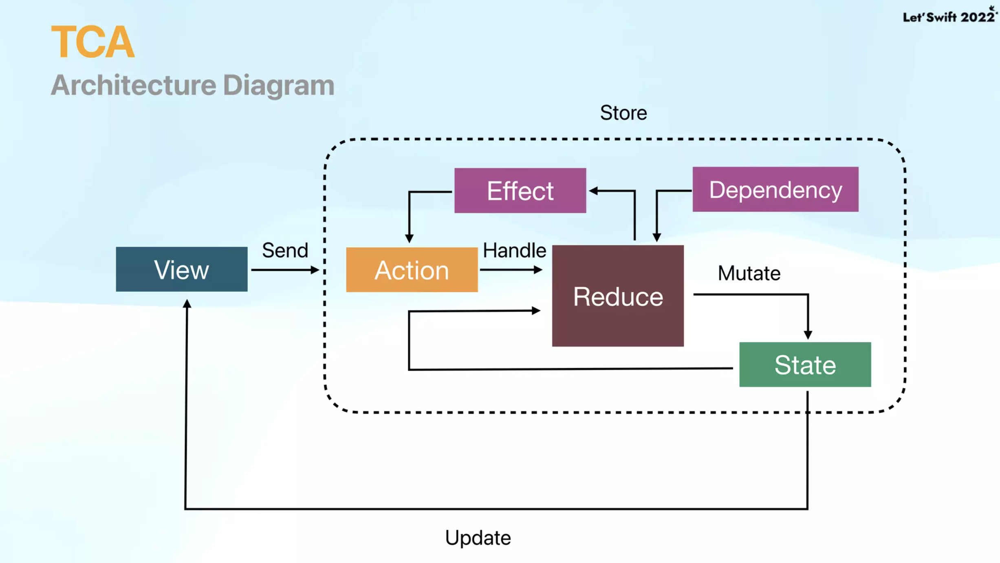

# TCA 란?

- PointFree에 의해 소개된 방식으로 **The Composable Architecture**의 약어로, Store의 State 변화에 따라 View를 업데이트 해 주는 상태 기반의 단반향 아키텍처입니다.
- 비슷한 방식에는 Redux, reswift, reactorkit, elm, MVI가 있다. 

# 기본 구성
To build a feature using the Composable Architecture you define some types and values that model your domain:\

### State
- A type that describes the data your feature needs to perform its logic and render its UI.
- 말 그대로 데이터 상태, 즉 도메인 상태를 의미함
  
### Action
- A type that represents all of the actions that can happen in your feature, such as user actions, notifications, event sources and more.
- 도메인 액션
  * ex) 검색이라면 검색어 입력, 검색어 삭제 등
  * 할 일이라면 할 일 삭제, 할 일 추가 등
   
### Reducer 
- A function that describes how to evolve the current state of the app to the next state given an action. The reducer is also responsible for returning any effects that should be run, such as API requests, which can be done by returning an Effect value.
- 액션과 상태를 연결시켜주는 역햘
  * 들어온 액션에 따라 상태를 변화시켜 주는 역할

### Store
- The runtime that actually drives your feature. You send all user actions to the store so that the store can run the reducer and effects, and you can observe state changes in the store so that you can update UI.
- 상태, 액션을 가지고 있음. 커맨드 센터

# Declarative UI and SwiftUI

 

# Why should I use TCA?
1. Better State Management
   - Reducer.State(RepoSearch)
   - Mutate states Only in reduce function
2. Easy to debug
3. Enhance Testability
   - Handling Side Effect(Github API)
   - Manage Dependency(RepoSearchClient)
4. Modularization(Composability)
   - Divide Reducers for one module
   - Easy to compose Reducers
   - Operators to compose reducers(combine, pullback, forEach...)

# MVVM과의 차이
- MVVM은 따로 관리
- 리덕스 관련 패턴은 스토어에서 종합적으로 관리. 액션을 주면 상태를 받는 식

# Effect and Dependency

### Dependency
- 외부에서의 의존성을 뜻함
- Low coupling,High Cohesion
- Using dirrernt Dependenciews in environments
- Make code maintainable

### Effect
- 리듀스에서 외부의 로직을 처리하기 위함 
- 외부의 로직을 실행하고, 외부 로직의 실행이 끝나면 그 결과로 새로운 액션을 trigger하거나 return none으로 액션을 trigger하지 않기 위함
- Execute side effect
- Trigger Action
- Push side effects to boundary
- Make reduce as pure function as possible 

# 참고 자료
- https://github.com/JYPjoy/swift-composable-architecture
- https://0urtrees.tistory.com/359
- 레츠스위프트22 발표 자료: https://www.slideshare.net/ssuser3d03b2/swiftui-tca-github-search
- PointFree
